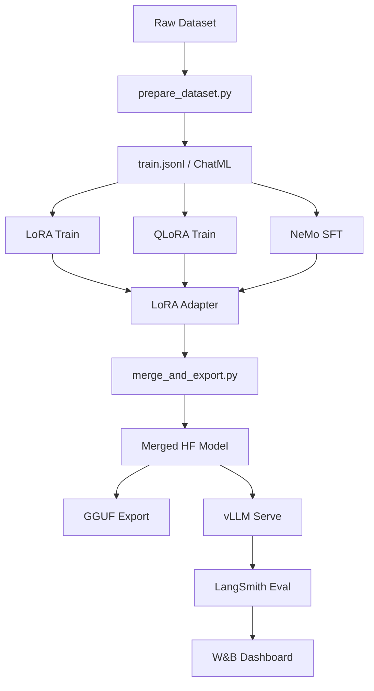

# Architecture — llm-finetuning-lab

## Training Pipeline

## Technique Comparison
| Technique | VRAM Required | Speed | Quality |
|---|---|---|---|
| Full FT | 80GB+ | Slow | Best |
| LoRA | 24GB+ | Fast | Near-full |
| QLoRA | 12GB+ | Medium | Good |
| NeMo SFT | 40GB+ | Fast | Best (enterprise) |
